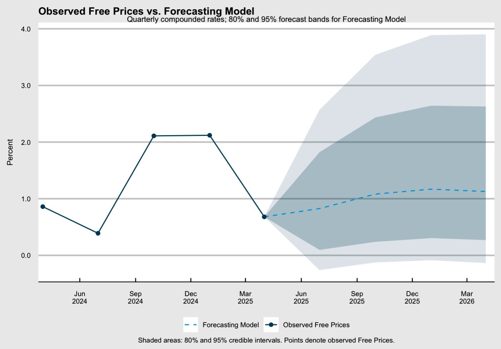

# Forecasting Inflation in Brazil

This repository contains the code, data, and methodology for forecasting Brazilian inflation, with a particular focus on **free prices** using time series econometric models.  
The approach is inspired by the methodology presented in *Box 2.1 – Inflation Report* from the **Central Bank of Brazil**, and adapted to quarterly and monthly datasets.

---

## 📊 Project Overview

The project estimates multiple classes of forecasting models, including:

- **Class I Statistical VAR Models**:  
  Factor-augmented VARs built from thematic macroeconomic indicator groups, with principal components extracted at the subgroup level.
  
- **Class II Statistical VAR Models**:  
  VARs combining three thematic groups at a time, exploring different factor extraction strategies.

- **Economic VAR, BVAR, and VECM Models**:  
  Benchmarks including Bayesian VARs and cointegration-based specifications.

The main forecasting target is **quarterly compounded free prices inflation** (`p_livre`), and all predictions are evaluated against observed data.

---

## 🔍 Methodology

1. **Data Preparation**  
   - Macroeconomic indicators collected from multiple official sources.
   - Series transformed, seasonally adjusted (when necessary), and aligned on a common observation horizon.
   - COVID dummy (`D_COVID`) included as an exogenous regressor.

2. **Model Estimation**  
   - Rolling-window out-of-sample forecasts to capture evolving dynamics.
   - Forecast horizons: up to **12 months ahead**.
   - Confidence and credible intervals at 80% and 95%.

3. **Forecast Evaluation**  
   - Comparison between observed and predicted free prices.
   - Visualization with shaded bands for uncertainty.

---

## 📈 Example Output

<p align="center">
  
</p>

*Figure: Observed Free Prices vs. Forecasting Model with 80% and 95% forecast bands.*

---

## 📂 Repository Structure

```plaintext
.
├── data/                
├── scripts/             
├── figures/             
├── results/             
├── requirement.R        
└── README.md            
